# Diagram Architektury UI - System Autentykacji Tripper

## Przegląd

Diagram przedstawia architekturę interfejsu użytkownika aplikacji Tripper po wdrożeniu systemu autentykacji. Pokazuje strukturę stron Astro, komponentów React, API endpoints oraz przepływ danych między nimi.

## Legenda

- **Prostokąty** - Strony Astro i komponenty React
- **Zaokrąglone prostokąty** - API Endpoints i usługi
- **Romby** - Punkty decyzyjne
- **Strzałki ciągłe** - Przepływ danych/renderowanie
- **Strzałki kropkowane** - Wywołania API
- **Strzałki grube** - Przekierowania

```mermaid
flowchart TD
    subgraph "Warstwa Middleware"
        MW[Middleware]
        MW --> |Tworzy klienta Supabase| SB[Supabase Client]
        MW --> |Wstrzykuje do| LOCALS[Astro.locals.supabase]
        MW --> |Zarządza| COOKIES[Cookies - Sesja]
    end

    subgraph "Moduł Autentykacji - Nowe Strony"
        LOGIN["/auth/login.astro"]
        REGISTER["/auth/register.astro"]
        FORGOT["/auth/forgot-password.astro"]
        RESET["/auth/reset-password.astro"]

        LOGIN --> |Renderuje| LOGINFORM["LoginForm.tsx"]
        REGISTER --> |Renderuje| REGISTERFORM["RegisterForm.tsx"]
        FORGOT --> |Renderuje| FORGOTFORM["ForgotPasswordForm.tsx"]
        RESET --> |Renderuje| RESETFORM["ResetPasswordForm.tsx"]

        LOGIN --> |Sprawdza sesję| SESS1{Sesja istnieje?}
        REGISTER --> |Sprawdza sesję| SESS2{Sesja istnieje?}

        SESS1 --> |Tak| DASH
        SESS2 --> |Tak| DASH
    end

    subgraph "Komponenty Formularzy Auth - Nowe"
        LOGINFORM
        REGISTERFORM
        FORGOTFORM
        RESETFORM

        LOGINFORM -.-> |POST| API_SIGNIN["API: /auth/signin"]
        REGISTERFORM -.-> |POST| API_SIGNUP["API: /auth/signup"]
        FORGOTFORM -.-> |POST| API_RESETPWD["API: /reset-password"]
        RESETFORM -.-> |POST| API_UPDATEPWD["API: /update-password"]
    end

    subgraph "API Autentykacji - Nowe Endpointy"
        API_SIGNIN
        API_SIGNUP
        API_SIGNOUT["API: /auth/signout"]
        API_RESETPWD
        API_UPDATEPWD

        API_SIGNIN --> |Wywołuje| SUPABASE_AUTH[Supabase Auth]
        API_SIGNUP --> |Wywołuje| SUPABASE_AUTH
        API_SIGNOUT --> |Wywołuje| SUPABASE_AUTH
        API_RESETPWD --> |Wywołuje| SUPABASE_AUTH
        API_UPDATEPWD --> |Wywołuje| SUPABASE_AUTH

        SUPABASE_AUTH --> |Ustawia/usuwa| COOKIES
        SUPABASE_AUTH --> |Wysyła| EMAIL[Email - Potwierdzenia]
    end

    subgraph "Walidacja i Helpery - Nowe"
        VALIDATORS["auth.validator.ts
        - loginSchema
        - registerSchema
        - resetPasswordSchema"]

        UTILS["auth.utils.ts
        - requireAuth
        - createUnauthorizedResponse"]

        ERRORS["auth.error.ts
        - AuthenticationError"]

        LOGINFORM --> |Waliduje| VALIDATORS
        REGISTERFORM --> |Waliduje| VALIDATORS
        RESETFORM --> |Waliduje| VALIDATORS

        API_SIGNIN --> |Używa| VALIDATORS
        API_SIGNUP --> |Używa| VALIDATORS

        API_SIGNIN --> |Obsługuje błędy| ERRORS
        API_SIGNUP --> |Obsługuje błędy| ERRORS
    end

    subgraph "Nawigacja - Zmodyfikowana"
        NAV["AppNavigation.astro
        (ZMODYFIKOWANY)"]

        NAVCONTENT["NavbarContent.tsx"]
        USERMENU["UserMenu.tsx
        (NOWY)"]

        NAV --> |Sprawdza sesję| SESS_NAV{Zalogowany?}
        NAV --> |Renderuje| NAVCONTENT

        SESS_NAV --> |Tak| USERMENU
        SESS_NAV --> |Nie| AUTH_LINKS["Zaloguj / Zarejestruj"]

        NAVCONTENT --> |Zawiera| USERMENU
        USERMENU -.-> |POST| API_SIGNOUT
    end

    subgraph "Layout - Współdzielony"
        LAYOUT["Layout.astro"]
        LAYOUT --> |Zawiera| NAV
    end

    subgraph "Chronione Strony - Zmodyfikowane"
        DASH["index.astro
        Dashboard
        (ZMODYFIKOWANY)"]

        PREFS["preferences.astro
        Preferencje
        (ZMODYFIKOWANY)"]

        TRIPNEW["trip-plans/new.astro
        Nowy Plan
        (ZMODYFIKOWANY)"]

        TRIPDETAILS["trip-plans/[id].astro
        Szczegóły
        (ZMODYFIKOWANY)"]

        DASH --> |Weryfikuje sesję| PROTECTED1{Sesja?}
        PREFS --> |Weryfikuje sesję| PROTECTED2{Sesja?}
        TRIPNEW --> |Weryfikuje sesję| PROTECTED3{Sesja?}
        TRIPDETAILS --> |Weryfikuje sesję| PROTECTED4{Sesja?}

        PROTECTED1 --> |Nie| LOGIN
        PROTECTED2 --> |Nie| LOGIN
        PROTECTED3 --> |Nie| LOGIN
        PROTECTED4 --> |Nie| LOGIN

        PROTECTED1 --> |Tak| DASHCONTENT["DashboardContent.tsx"]
        PROTECTED2 --> |Tak| PREFSCONTENT["PreferencesView.tsx"]
        PROTECTED3 --> |Tak| TRIPCONTENT["CreateTripPlanContent.tsx"]
        PROTECTED4 --> |Tak| TRIPVIEW["TripPlanDetailsView.tsx"]
    end

    subgraph "Komponenty Dashboard - Istniejące"
        DASHCONTENT
        PLANSLIST["PlansList.tsx"]
        PLANCARD["PlanCard.tsx"]
        CREATEBTN["CreatePlanButton.tsx"]

        DASHCONTENT --> |Zawiera| PLANSLIST
        PLANSLIST --> |Renderuje| PLANCARD
        DASHCONTENT --> |Zawiera| CREATEBTN
    end

    subgraph "Komponenty Preferencji - Istniejące"
        PREFSCONTENT
        PREFCARD["PreferenceCard.tsx"]
        PREFDIALOG["PreferenceFormDialog.tsx"]

        PREFSCONTENT --> |Renderuje| PREFCARD
        PREFSCONTENT --> |Zawiera| PREFDIALOG
    end

    subgraph "Komponenty Trip Plans - Istniejące"
        TRIPCONTENT
        TRIPFORM["TripPlanForm.tsx"]
        GENPLAN["GeneratedPlanSection.tsx"]
        DAYCARD["DayCard.tsx"]

        TRIPCONTENT --> |Zawiera| TRIPFORM
        TRIPCONTENT --> |Zawiera| GENPLAN
        GENPLAN --> |Renderuje| DAYCARD

        TRIPVIEW
        TRIPHEADER["TripPlanHeader.tsx"]
        PLANDAY["PlanDay.tsx"]
        ACTCARD["ActivityCard.tsx"]

        TRIPVIEW --> |Zawiera| TRIPHEADER
        TRIPVIEW --> |Renderuje| PLANDAY
        PLANDAY --> |Renderuje| ACTCARD
    end

    subgraph "API Użytkownika - Zmodyfikowane"
        API_PREFS["API: /user/preferences
        (ZMODYFIKOWANY)"]

        API_PREFS_ID["API: /user/preferences/[id]
        (ZMODYFIKOWANY)"]

        API_PREFS --> |Używa| UTILS
        API_PREFS_ID --> |Używa| UTILS

        PREFSCONTENT -.-> |GET/POST| API_PREFS
        PREFDIALOG -.-> |PUT/DELETE| API_PREFS_ID
    end

    subgraph "API Trip Plans - Zmodyfikowane"
        API_TRIPS["API: /trip-plans
        (ZMODYFIKOWANY)"]

        API_TRIPS_ID["API: /trip-plans/[id]
        (ZMODYFIKOWANY)"]

        API_GENERATE["API: /trip-plans/generate
        (ZMODYFIKOWANY)"]

        API_TRIPS --> |Używa| UTILS
        API_TRIPS_ID --> |Używa| UTILS
        API_GENERATE --> |Używa| UTILS

        DASHCONTENT -.-> |GET| API_TRIPS
        TRIPFORM -.-> |POST| API_GENERATE
        TRIPVIEW -.-> |GET/PATCH| API_TRIPS_ID
        PLANCARD -.-> |DELETE| API_TRIPS_ID
    end

    subgraph "Komponenty UI - Shadcn/ui"
        UICOMPS["Card, Input, Label,
        Button, Alert,
        Dialog, Select"]

        DROPDOWN["DropdownMenu
        (NOWY)"]

        LOGINFORM --> |Używa| UICOMPS
        REGISTERFORM --> |Używa| UICOMPS
        FORGOTFORM --> |Używa| UICOMPS
        RESETFORM --> |Używa| UICOMPS
        USERMENU --> |Używa| DROPDOWN
    end

    subgraph "Backend - Supabase"
        SUPABASE_AUTH
        SUPABASE_DB["Supabase Database
        - RLS Policies
        - user_preferences
        - trip_plans"]

        API_PREFS --> |Query| SUPABASE_DB
        API_TRIPS --> |Query| SUPABASE_DB
        API_GENERATE --> |Query| SUPABASE_DB

        SUPABASE_DB --> |Filtruje po| USERID[user_id z auth.uid]
    end

    %% Przepływy Użytkownika
    API_SIGNIN ==> |Sukces| DASH
    API_SIGNUP ==> |Sukces| LOGIN
    API_SIGNOUT ==> |Sukces| LOGIN
    API_UPDATEPWD ==> |Sukces| LOGIN

    CREATEBTN ==> |Przekierowanie| TRIPNEW
    PLANCARD ==> |Kliknięcie| TRIPDETAILS

    %% Style dla wyróżnienia nowych i zmodyfikowanych komponentów
    classDef newComponent fill:#90EE90,stroke:#2E8B57,stroke-width:2px
    classDef modifiedComponent fill:#FFD700,stroke:#DAA520,stroke-width:2px
    classDef apiEndpoint fill:#87CEEB,stroke:#4682B4,stroke-width:2px
    classDef middleware fill:#DDA0DD,stroke:#9370DB,stroke-width:2px

    class LOGIN,REGISTER,FORGOT,RESET,LOGINFORM,REGISTERFORM,FORGOTFORM,RESETFORM,USERMENU,API_SIGNIN,API_SIGNUP,API_SIGNOUT,API_RESETPWD,API_UPDATEPWD,VALIDATORS,UTILS,ERRORS,DROPDOWN newComponent

    class NAV,DASH,PREFS,TRIPNEW,TRIPDETAILS,API_PREFS,API_PREFS_ID,API_TRIPS,API_TRIPS_ID,API_GENERATE modifiedComponent

    class API_SIGNIN,API_SIGNUP,API_SIGNOUT,API_RESETPWD,API_UPDATEPWD,API_PREFS,API_PREFS_ID,API_TRIPS,API_TRIPS_ID,API_GENERATE apiEndpoint

    class MW,LOCALS,COOKIES middleware
```



## Kluczowe Zmiany w Architekturze

### 1. Nowe Komponenty (Zielone)

- 4 strony autentykacji (login, register, forgot-password, reset-password)
- 4 komponenty formularzy React
- UserMenu w nawigacji
- 5 API endpoints autentykacji
- Walidatory, utils i error classes

### 2. Zmodyfikowane Komponenty (Żółte)

- AppNavigation.astro - dodanie UserMenu i logiki warunkowej
- Wszystkie chronione strony - weryfikacja sesji
- Wszystkie API endpoints - użycie requireAuth()

### 3. Przepływ Autentykacji

#### Logowanie:

```
User → login.astro → LoginForm → POST /auth/signin → Supabase Auth → Cookies → Dashboard
```

#### Rejestracja:

```
User → register.astro → RegisterForm → POST /auth/signup → Supabase Auth → Email → Login
```

#### Ochrona Stron:

```
Request → Middleware → Supabase Client → Protected Page → Session Check → Render/Redirect
```

#### Ochrona API:

```
Request → API Endpoint → requireAuth() → userId → Service → Supabase (RLS) → Response
```

## Zależności

- **@supabase/ssr** - Zarządzanie sesją i cookies
- **@supabase/supabase-js** - Klient Supabase
- **zod** - Walidacja
- **shadcn/ui** - Komponenty UI (w tym nowy DropdownMenu)

## Bezpieczeństwo

- **RLS Policies** - Filtrowanie danych po user_id
- **httpOnly Cookies** - Tokeny niedostępne dla JavaScript
- **SSR Session Verification** - Weryfikacja po stronie serwera
- **API Authentication** - requireAuth() na wszystkich endpointach
